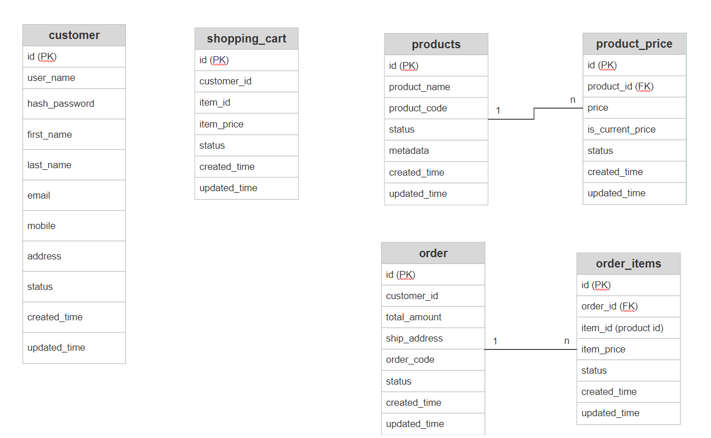
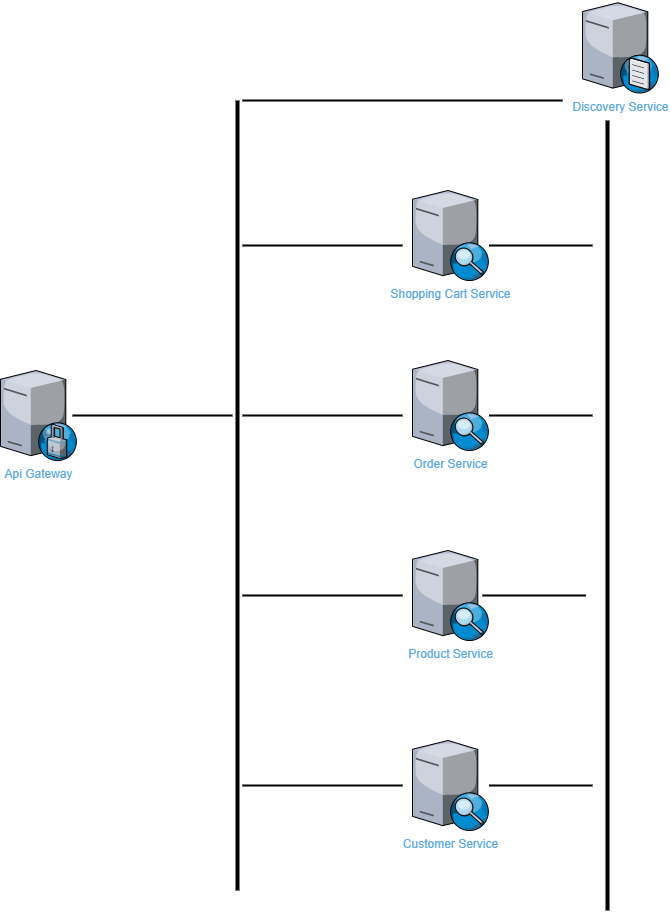

### NAB Assignment "iCommerce" Introduce
##### Scope of work
Just focus on build project follow the topic "iCommerce" to demo how to build it in microservices.
So, it`s very simple and limited set of functionalities.


#### I. Approach Solution & Tech Stack
1. Main tech stacks: 
    Language/Framework: 
            - java 11 
            - spring boot 2.6.2
            - spring cloud 2021.0.0 (spring cloud gateway, discovery service eureka, sleuth, openfeign)
            - spock, logback 1.2.10, lombok 1.18.22
    Database: mysql
    Tools: mvn, mysql, flyway-8.4.0
2. System Requisites:
   - Java 11
   - MySQL Server 8.0
   - Apache Maven 3.8.1

#### II. Architecture model & ERD, service introduction
To build a very simple online shopping application,
just support very basic feature to demo code, unit testing some cover cases, structure, 
many others feature will not include such as: authentication, circuit breaker, caching etc...
##### Service introduce
- discovery-server: A spring cloud discovery service base on Netflix Eureka, handle registry and discovery services.
- gateway:  A Spring Cloud Gateway responsible handle process request from client as a gateway of system, handle the request forward to destination service
- customer-service: (CRUD for customer)
  - Support:
    - create new customer
    - get customer info
- purchase-order-service (CRUD for a purchase order)
    - Support:
        - create order (with shopping cart data)
        - fetch order infomation
- shopping-cart-service: (CRUD shopping cart)
    - Support:
         - add product item into shopping cart
         - fetch shopping cart item
- product-service: (CRUD product)
    - Support:
         - create new product 
         - get product information

### ERDiagram DBSM:
- Some table will not have direct relation, due to can separate it in each schema belong to service domain, so in this scope for simples, still put it into same schema/db to present
    


## Architecture model:


#### III. How to run

1. DB setup:
   1.1 create new db on your local named: nab_icommerce
   1.2 make sure flyway config pointing nab_icommerce db
   1.2 cd <icommerce path>/db.migrate/
   1.3 copy V1.0.0__init_db_icommerce.sql into flyway/sql/
   1.4 run flyway migration
2. Execute:
    2.1 cd to the directory where store icommerce repo
    2.2 Build projects: cd <icommerce path>/build-run-script/
    2.3 Run build.bat
    2.4 Run projects: cd <icommerce path>/build-run-script/
    2.5 Run run-services.bat
   
3. Curls
    Note: All Curl will to call to gateway service run at port 9080
    
    3.1 Shopping cart
    
    Add product item in to shopping cart:
    
    ```
        curl --location --request POST 'http://localhost:9080/icommerce/v1/shopping-cart' \
           --header 'Content-Type: application/json' \
           --data-raw '{
           "customerId": "1",
           "productId": "1",
           "price": 20000
           }' 
    ```
    Fetch customer shopping cart information
    
    ```         
    curl --location --request GET 'http://localhost:9080/icommerce/v1/shopping-cart?customerId=1'
    ```
   
    3.2 Product
    Create a new product
    ```
    curl --location --request POST 'http://localhost:9080/icommerce/v1/product' \
       --header 'Content-Type: application/json' \
       --data-raw '{
       "productName": "sach lop 4",
       "productCode": "SGK 4",
       "price": 20000
       }' 
    ```
    Get product information
    ``` 
            curl --location --request GET 'http://localhost:9080/icommerce/v1/product?productCode=SGK 4' 
    ```
    
    3.3 Customer
        Regis a new customer
     ``` 
        curl --location --request POST 'http://localhost:9080/icommerce/v1/customer' \
           --header 'Content-Type: application/json' \
           --data-raw '{
           "email": "test@gmail.com",
           "firstName": "Test",
           "lastName": "User",
           "address": "TP HCM",
           "userName": "testUser"
           }' 
    ```
        
        Get customer info
    ``` 
        curl --location --request GET 'http://localhost:9080/icommerce/v1/customer' 
    ```
    3.4 Order
        Create new order by shopping cart infomation
    
     ``` 
        curl --location --request POST 'http://localhost:9080/icommerce/v1/purchase-order' \
           --header 'Content-Type: application/json' \
           --data-raw '[
           {
           "customerId": 1,
           "productId": 1,
           "productPrice": 20000,
           "status": "AVAILABLE"
           },
           {
           "customerId": 1,
           "productId": 2,
           "productPrice": 10000,
           "status": "AVAILABLE"
           }
           ]' 
    ```

    Fetch order infomation
    
    ``` 
        curl --location --request GET 'http://localhost:9080/icommerce/v1/purchase-order?customerId=1' 
    ```
    
